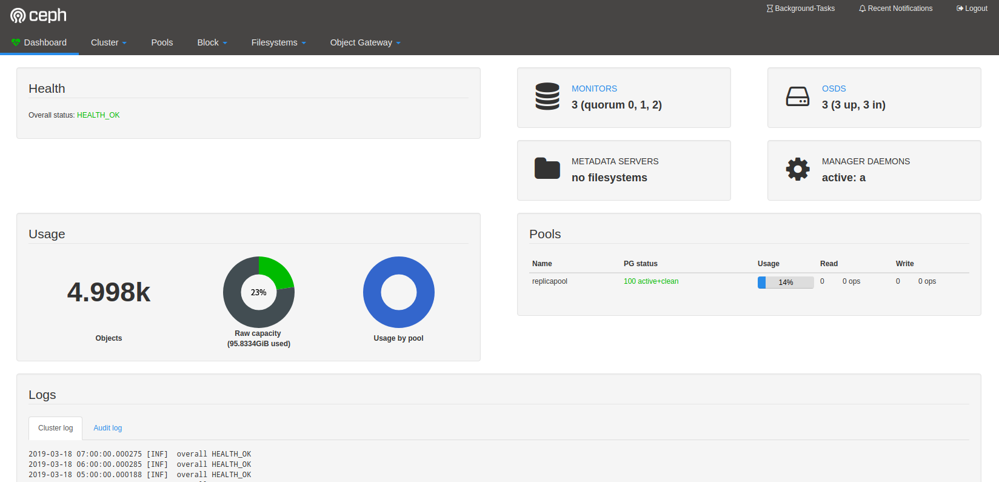

# 使用rook搭建存储集群

rook是云原生的存储**协调器**,为各种存储提供解决方案,提供自我管理,自我扩展,自我修复的存储服务,在kubernetes中实际实现是operator方式.

在rook 0.9版本中,Ceph已经是**beta**支持状态了.

Ceph是一种高度可扩展的分布式存储解决方案，适用于具有多年生产部署的块存储，对象存储和共享文件系统.

## 安装

rook提供了operator的方式来处理ceph存储的安装,所以此处安装使用helm来安装rook

```shell
helm repo add rook-stable https://charts.rook.io/stable
helm install --namespace rook-ceph-system rook-stable/rook-ceph
```

## ceph集群

安装了rook后,还需要在rook中声明CRD来建立ceph集群

`cluster.yaml`

```yaml
apiVersion: v1
kind: Namespace
metadata:
  name: rook-ceph
---
apiVersion: v1
kind: ServiceAccount
metadata:
  name: rook-ceph-osd
  namespace: rook-ceph
---
apiVersion: v1
kind: ServiceAccount
metadata:
  name: rook-ceph-mgr
  namespace: rook-ceph
---
kind: Role
apiVersion: rbac.authorization.k8s.io/v1beta1
metadata:
  name: rook-ceph-osd
  namespace: rook-ceph
rules:
- apiGroups: [""]
  resources: ["configmaps"]
  verbs: [ "get", "list", "watch", "create", "update", "delete" ]
---
kind: Role
apiVersion: rbac.authorization.k8s.io/v1beta1
metadata:
  name: rook-ceph-mgr-system
  namespace: rook-ceph
rules:
- apiGroups:
  - ""
  resources:
  - configmaps
  verbs:
  - get
  - list
  - watch
---
kind: Role
apiVersion: rbac.authorization.k8s.io/v1beta1
metadata:
  name: rook-ceph-mgr
  namespace: rook-ceph
rules:
- apiGroups:
  - ""
  resources:
  - pods
  - services
  verbs:
  - get
  - list
  - watch
- apiGroups:
  - batch
  resources:
  - jobs
  verbs:
  - get
  - list
  - watch
  - create
  - update
  - delete
- apiGroups:
  - ceph.rook.io
  resources:
  - "*"
  verbs:
  - "*"
---
kind: RoleBinding
apiVersion: rbac.authorization.k8s.io/v1beta1
metadata:
  name: rook-ceph-cluster-mgmt
  namespace: rook-ceph
roleRef:
  apiGroup: rbac.authorization.k8s.io
  kind: ClusterRole
  name: rook-ceph-cluster-mgmt
subjects:
- kind: ServiceAccount
  name: rook-ceph-system
  namespace: rook-ceph-system #注意,这里一定要授权给rook的namespace中的account
---
kind: RoleBinding
apiVersion: rbac.authorization.k8s.io/v1beta1
metadata:
  name: rook-ceph-osd
  namespace: rook-ceph
roleRef:
  apiGroup: rbac.authorization.k8s.io
  kind: Role
  name: rook-ceph-osd
subjects:
- kind: ServiceAccount
  name: rook-ceph-osd
  namespace: rook-ceph
---
kind: RoleBinding
apiVersion: rbac.authorization.k8s.io/v1beta1
metadata:
  name: rook-ceph-mgr
  namespace: rook-ceph
roleRef:
  apiGroup: rbac.authorization.k8s.io
  kind: Role
  name: rook-ceph-mgr
subjects:
- kind: ServiceAccount
  name: rook-ceph-mgr
  namespace: rook-ceph
---
kind: RoleBinding
apiVersion: rbac.authorization.k8s.io/v1beta1
metadata:
  name: rook-ceph-mgr-system
  namespace: rook-ceph-system	#注意,这里是绑定rook系统的role到rook-ceph系统中
roleRef:
  apiGroup: rbac.authorization.k8s.io
  kind: Role
  name: rook-ceph-mgr-system
subjects:
- kind: ServiceAccount
  name: rook-ceph-mgr
  namespace: rook-ceph
---
kind: RoleBinding
apiVersion: rbac.authorization.k8s.io/v1beta1
metadata:
  name: rook-ceph-mgr-cluster
  namespace: rook-ceph
roleRef:
  apiGroup: rbac.authorization.k8s.io
  kind: ClusterRole
  name: rook-ceph-mgr-cluster
subjects:
- kind: ServiceAccount
  name: rook-ceph-mgr
  namespace: rook-ceph
---
apiVersion: ceph.rook.io/v1
kind: CephCluster
metadata:
  name: rook-ceph
  namespace: rook-ceph
spec:
  cephVersion:
    image: ceph/ceph:v13.2.4-20190315
  dataDirHostPath: /var/lib/rook
  dashboard:
    enabled: true
  mon:
    count: 3
    allowMultiplePerNode: true
  storage:
    useAllNodes: true
    useAllDevices: false
    config:
      databaseSizeMB: "1024"
      journalSizeMB: "1024"
```

> 注意: rolebinding 需要注意有一些地方是和之前使用helm安装的时候的namespace中的资源绑定
>
> ceph的image 可以通过https://hub.docker.com/r/ceph/ceph/tags 查看

## 安装dashboard



在上一步的安装命令中如果启用了dashboard,则可以看到以下service

```shell
$ kubectl -n rook-ceph get service
NAME                         TYPE        CLUSTER-IP       EXTERNAL-IP   PORT(S)          AGE
rook-ceph-mgr                ClusterIP   10.108.111.192   <none>        9283/TCP         3h
rook-ceph-mgr-dashboard      ClusterIP   10.110.113.240   <none>        8443/TCP         3h
```

dashboard默认的登录名称为`admin`,默认密码需要查看secret `rook-ceph-dashboard-password`,并使用base64解析出来:

```shell
$ kubectl -n rook-ceph get secret rook-ceph-dashboard-password -o yaml | grep "password:" | awk '{print $2}' | base64 --decode
3UWLhC0FIK
```

如果想将dashboard暴露到外部,可以通过自定义service的方式,操作如下:

dashboard-ext.yaml

```yaml
apiVersion: v1
kind: Service
metadata:
  name: rook-ceph-mgr-dashboard-external-https
  namespace: rook-ceph
  labels:
    app: rook-ceph-mgr
    rook_cluster: rook-ceph
spec:
  ports:
  - name: dashboard
    port: 8443
    protocol: TCP
    targetPort: 8443
  selector:
    app: rook-ceph-mgr
    rook_cluster: rook-ceph
  sessionAffinity: None
  type: NodePort
```

```shell
$ kubectl create -f dashboard-ext.yaml
$ kubectl -n rook-ceph get service
NAME                                    TYPE        CLUSTER-IP       EXTERNAL-IP   PORT(S)          AGE
rook-ceph-mgr                           ClusterIP   10.108.111.192   <none>        9283/TCP         4h
rook-ceph-mgr-dashboard                 ClusterIP   10.110.113.240   <none>        8443/TCP         4h
rook-ceph-mgr-dashboard-external-https  NodePort    10.101.209.6     <none>        8443:31176/TCP   4h
```

## 创建块存储

`storageclass.yaml`

```yaml
apiVersion: ceph.rook.io/v1
kind: CephBlockPool
metadata:
  name: replicapool
  namespace: rook-ceph
spec:
  failureDomain: host
  replicated:
    size: 3
```

## 创建storageclass

`storageclass.yaml`

````yaml
apiVersion: storage.k8s.io/v1
kind: StorageClass
metadata:
   name: rook-ceph-block
provisioner: ceph.rook.io/block
parameters:
  blockPool: replicapool
  clusterNamespace: rook-ceph
  fstype: xfs
reclaimPolicy: Retain
````

## ElasticSearch-Demo

以ElasticSearch在k8s中的部署为例,为大家展示使用:

`es.yaml`

```yaml
# RBAC authn and authz
apiVersion: v1
kind: ServiceAccount
metadata:
  name: elasticsearch-logging
  namespace: kube-system
  labels:
    k8s-app: elasticsearch-logging
    kubernetes.io/cluster-service: "true"
    addonmanager.kubernetes.io/mode: Reconcile
---
kind: ClusterRole
apiVersion: rbac.authorization.k8s.io/v1
metadata:
  name: elasticsearch-logging
  labels:
    k8s-app: elasticsearch-logging
    kubernetes.io/cluster-service: "true"
    addonmanager.kubernetes.io/mode: Reconcile
rules:
  - apiGroups:
      - ""
    resources:
      - "services"
      - "namespaces"
      - "endpoints"
    verbs:
      - "get"
---
kind: ClusterRoleBinding
apiVersion: rbac.authorization.k8s.io/v1
metadata:
  namespace: kube-system
  name: elasticsearch-logging
  labels:
    k8s-app: elasticsearch-logging
    kubernetes.io/cluster-service: "true"
    addonmanager.kubernetes.io/mode: Reconcile
subjects:
  - kind: ServiceAccount
    name: elasticsearch-logging
    namespace: kube-system
    apiGroup: ""
roleRef:
  kind: ClusterRole
  name: elasticsearch-logging
  apiGroup: ""
---
# Elasticsearch deployment itself
apiVersion: apps/v1
kind: StatefulSet
metadata:
  name: elasticsearch-logging
  namespace: kube-system
  labels:
    k8s-app: elasticsearch-logging
    version: v6.3.0
    kubernetes.io/cluster-service: "true"
    addonmanager.kubernetes.io/mode: Reconcile
spec:
  serviceName: elasticsearch-logging
  replicas: 2
  selector:
    matchLabels:
      k8s-app: elasticsearch-logging
      version: v6.3.0
  template:
    metadata:
      labels:
        k8s-app: elasticsearch-logging
        version: v6.3.0
        kubernetes.io/cluster-service: "true"
    spec:
      serviceAccountName: elasticsearch-logging
      containers:
        - image: k8s.gcr.io/elasticsearch:v6.3.0
          name: elasticsearch-logging
          resources:
            limits:
              cpu: 1000m
            requests:
              cpu: 100m
          ports:
            - containerPort: 9200
              name: db
              protocol: TCP
            - containerPort: 9300
              name: transport
              protocol: TCP
          volumeMounts:
            - name: elasticsearch-logging
              mountPath: /data
          env:
            - name: "NAMESPACE"
              valueFrom:
                fieldRef:
                  fieldPath: metadata.namespace
      initContainers:
        - image: alpine:3.6
          command: ["/sbin/sysctl", "-w", "vm.max_map_count=262144"]
          name: elasticsearch-logging-init
          securityContext:
            privileged: true
  volumeClaimTemplates:
    - metadata:
        name: elasticsearch-logging
      spec:
        accessModes: ["ReadWriteOnce","ReadOnlyMany","ReadWriteMany"]
        storageClassName: rook-ceph-block	#此处为上一步创建的storageclass名称
        resources:
          requests:
            storage: 100G
```


