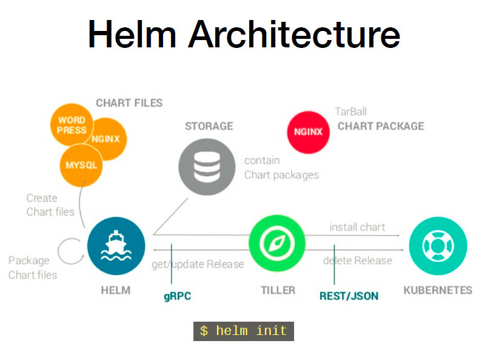

# helm简介

## 简介

helm是k8s中的**包管理器**,每一个包称为一个`chart`,helm使用更为便捷的方式来管理我们k8s集群上的应用的安装和分发.

helm下载地址如下: https://github.com/helm/helm/releases

下载解压后,将二进制可执行文件`helm`放在`$path`下即可

在helm中有三个重要的概念:

- `chart` 应用的模板
- `release` 应用的实例,用模板+ values.yaml运行起来的实际应用实例
- `repo` 仓库,存放应用模板的地方

整体的架构图如下:



一个chart实际为一个目录,目录大致如下:

```shell
#创建一个mychart的应用
$ helm create mychart
#查看应用目录结构
$ tree mychart/
mychart/
├── charts
├── Chart.yaml	#用于描述这个Chart的相关信息,包括名字,描述信息以及版本等。
├── templates	#目录下是YAML文件的模板,该模板文件遵循Go template语法。
│   ├── deployment.yaml
│   ├── _helpers.tpl
│   ├── ingress.yaml
│   ├── NOTES.txt
│   └── service.yaml
└── values.yaml	#用于存储templates目录中模板文件中用到变量的值。\
```

一个典型的helm chart文件目录如下:

```shell
examples/
  Chart.yaml          # Yaml文件，用于描述Chart的基本信息，包括名称版本等
  LICENSE             # [可选] 协议
  README.md           # [可选] 当前Chart的介绍
  values.yaml         # Chart的默认配置文件
  requirements.yaml   # [可选] 用于存放当前Chart依赖的其它Chart的说明文件
  charts/             # [可选]: 该目录中放置当前Chart依赖的其它Chart
  templates/          # [可选]: 部署文件模版目录，模版使用的值来自values.yaml和由Tiller提供的值
  templates/NOTES.txt # [可选]: 放置Chart的使用指南
```

`Chart.yaml`主要用来描述此应用的相关信息,具体格式如下:

```yaml
name: [必须] Chart的名称
version: [必须] Chart的版本号，版本号必须符合 SemVer 2：http://semver.org/
description: [可选] Chart的简要描述
keywords:
  -  [可选] 关键字列表
home: [可选] 项目地址
sources:
  - [可选] 当前Chart的下载地址列表
maintainers: # [可选]
  - name: [必须] 名字
    email: [可选] 邮箱
engine: gotpl # [可选] 模版引擎，默认值是gotpl
icon: [可选] 一个SVG或PNG格式的图片地址
```

`requirements.yaml`主要用来描述依赖的chart,具体格式如下:

```yaml
dependencies:
  - name: example
    version: 1.2.3
    repository: http://example.com/charts
  - name: Chart名称
    version: Chart版本
    repository: 该Chart所在的仓库地址
```

## 命令介绍

### init 安装tiller

```shell
$ helm init --upgrade -i registry.cn-hangzhou.aliyuncs.com/google_containers/tiller:v2.11.0 --stable-repo-url https://kubernetes.oss-cn-hangzhou.aliyuncs.com/charts --service-account=clusterrole-aggregation-controller
```

在安装时,使用阿里云的镜像替换了本身的镜像

在安装时,同时修改了stable的repo地址为阿里云的地址,同时指定了service-account

### reset 卸载

```shell
helm reset 或helm reset -f(强制删除 k8s 集群上的 pod.)
```

此操作会删除k8s集群中的tiller,但是并不会删除你本地的任何东西.

### create 创建应用

```shell
#创建 应用
$ helm create mychart
```

在创建应用后可以修改目录文件中的内容,形成自己的应用描述.

### lint 检查

在修改文件后一定要使用

```shell
$ helm lint mychart/
```

进行验证依赖项和模板是否正确

### package 打包为tgz

```shell
$ helm package mychart
Successfully packaged chart and saved it to: /xxxx/mychart-0.1.0.tgz
```

> 这里的0.1.0版本号是从Chart.yaml的version字段中读取的.

在做成应用后可上传到服务器上,分享给其他人公开访问

### inspect 查看应用描述

在客户端中可以使用inspect查看该应用详情

```shell
$ helm inspect stable/mysql
```

> `helm inspect readme [CHART] [flags]`命令显示read.me中的内容
>
> `helm inspect values [CHART] [flags]`显示values中的内容

### fetch 下载到本地

有一些应用的values.yaml需要下载到本地进行编辑,可以使用如下方式

```shell
$ helm fetch stable/mysql
```

### template 渲染模板

```shell
#helm template [flags] CHART
$ helm template install/kubernetes/helm/istio --name istio --namespace istio-system -f 修改后的value路径.yaml > ./istio.yaml
```

> istio就是使用此方式安装的.

### get 下载release到本地

下载已经存在的release到本地

```shell
$ helm get hulking-rub
REVISION: 1
RELEASED: Fri Mar 15 16:49:13 2019
CHART: metrics-server-2.2.1
USER-SUPPLIED VALUES:
image:
  registry: docker.io
  repository: bitnami/metrics-server
#省略一大坨......
COMPUTED VALUES:
apiService:
  create: true
image:
  pullPolicy: Always
#省略一大坨......

HOOKS:
MANIFEST:

---
# Source: metrics-server/templates/serviceaccount.yaml
apiVersion: v1
kind: ServiceAccount
#省略一大坨......
```

> 注意,这里是下载release,不是chart
>
> `helm get values [flags] RELEASE-NAME` 下载values内容

### install 安装应用

如果需要安装某个应用则可以使用install命令

```shell
$ helm install stable/mysql -f values.yaml
```

安装还可以指定release名称等信息

### upgrade 升级应用

在应用的chart更新后可以通过helm对release进行升级(假设现在为1.0版本,升级到2.0版本),命令如下:

```shell
#helm upgrade [RELEASE] [CHART] [flags]
$ helm upgrade test stable/mysql -f values.yaml --version 2.0
```

> 如果没有指定--version则使用最新版本

### delete 删除release

```shell
#helm delete [flags] RELEASE-NAME [...]
$ helm delete test
```

> `--purge` 从存储库中移除该版本,并释放其名称以供其他应用使用

### history 查看历史

```shell
# helm history [flags] RELEASE-NAME
$ helm history hulking-rub
REVISION	UPDATED                 	STATUS  	CHART               	DESCRIPTION     
1       	Fri Mar 15 16:49:13 2019	DEPLOYED	metrics-server-2.2.1	Install complete
```

### rollback 回滚到某个版本

```shell
helm rollback [flags] [RELEASE] [REVISION]
```

> 要回滚到上一个版本,请使用 `helm rollback xxx 0 `

### status 查看release当前状态

```shell
#helm status [flags] RELEASE-NAME
$ helm status hulking-rub
LAST DEPLOYED: Fri Mar 15 16:49:13 2019
NAMESPACE: test
STATUS: DEPLOYED

RESOURCES:
==> v1/ServiceAccount
NAME                      AGE
hulking-rub-metricsserve  2d
==> v1beta2/Deployment
hulking-rub-metricsserve  2d
==> v1beta1/APIService
v1beta1.metrics.k8s.io  2d
==> v1/Pod(related)
NAME                                       READY  STATUS   RESTARTS  AGE
hulking-rub-metricsserve-77599865c6-v7r5q  1/1    Running  0         2d

```

### repo 管理

repo管理较为简单,一共4个命令

```shell
helm repo add [flags] [NAME] [URL]
helm repo list [flags] [NAME] [URL]
helm repo remove [flags] [NAME] [URL]
helm repo update [flags] [NAME] [URL]
```

> repo没有编辑,写错了就删除重来
>
> 删除命令不是delete 是remove


在很多命令中出现了一个可选项是` --dry-run`,此选项为模拟命令行为进行测试.

## kubeapps

Kubeapps是一个基于Web的UI，用于在Kubernetes集群中部署和管理应用程序

### 安装

```shell
helm repo add bitnami https://charts.bitnami.com/bitnami
helm install --name kubeapps --namespace kubeapps bitnami/kubeapps
```

### 创建clusterrole

```shell
kubectl create serviceaccount kubeapps-operator
kubectl create clusterrolebinding kubeapps-operator --clusterrole=cluster-admin --serviceaccount=default:kubeapps-operator
```

### 查看登录密码

```shell
kubectl get secret $(kubectl get serviceaccount kubeapps-operator -o jsonpath='{.secrets[].name}') -o jsonpath='{.data.token}' | base64 --decode
```

## 常用存储库

- stable https://github.com/helm/charts
- fabric8 https://fabric8.io/helm
- aliyun https://kubernetes.oss-cn-hangzhou.aliyuncs.com/charts (版本超级旧)
- bitnami https://charts.bitnami.com/bitnami